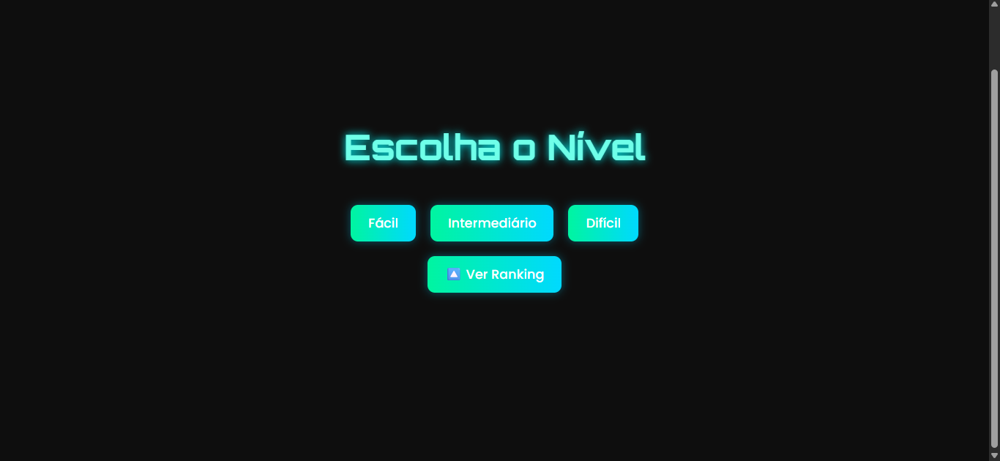
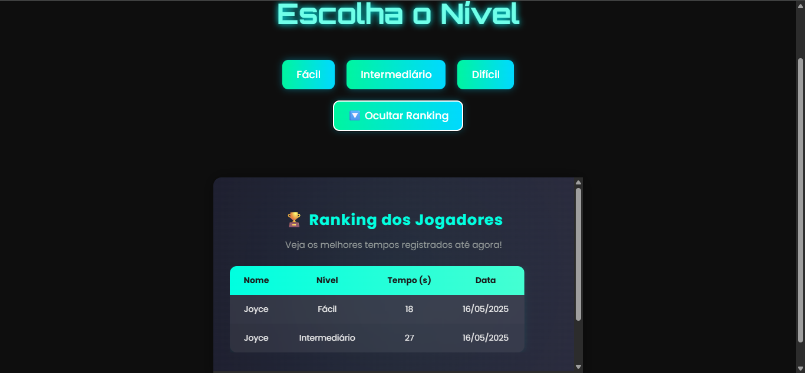
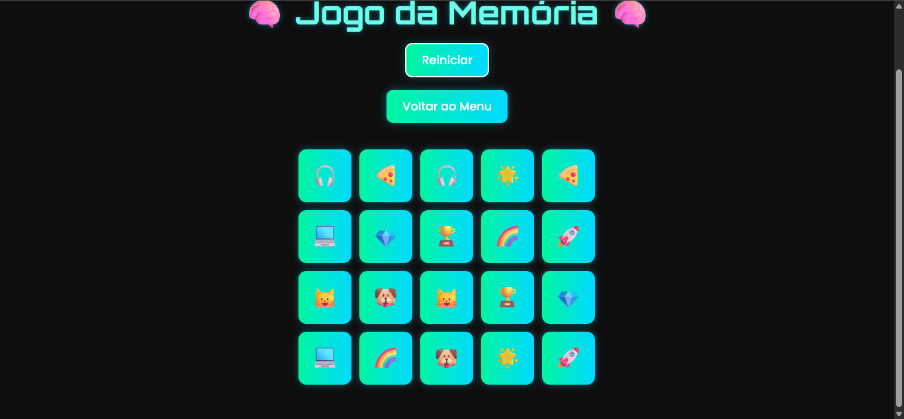
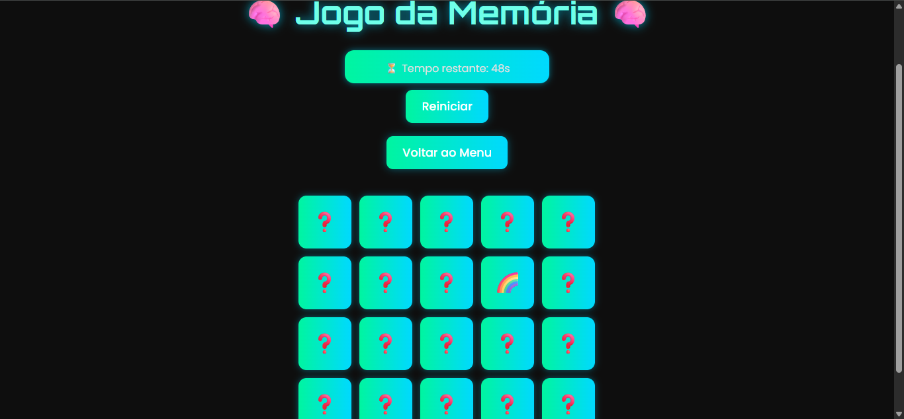
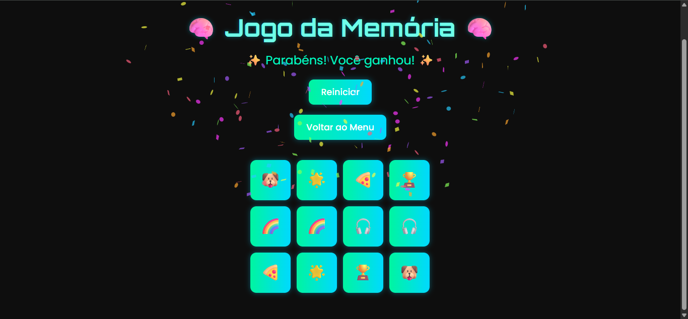

# Memory Game — Jogo da Memória

## Sobre o Projeto

**Memory Game** é um jogo da memória online, desenvolvido com muito carinho utilizando tecnologias web. Nele, o jogador escolhe o nível de dificuldade e precisa encontrar todos os pares de cartas no menor tempo possível.

---

## Funcionalidades

- Escolha de **nível de dificuldade**: Fácil, Intermediário e Difícil.
- **Sistema de tempo**: cada nível tem um tempo limite.
- **Ranking dos melhores jogadores**: registra nome, tempo, nível e data.
- Feedback visual de **vitória**, **derrota** e até **confetes** quando ganha! 🎉

---

## Tecnologias Utilizadas

### 🖥️ **Frontend**
- ReactJS
- CSS puro (com animações e responsividade)

### 🔗 **Backend**
- Node.js
- Express

### 🗂️ **Armazenamento**
- Arquivo JSON local para gerenciar o ranking dos jogadores

---

##  Diferenciais do Projeto

- Interface moderna, neon, com pegada tecnológica
- Totalmente responsivo — funciona em desktop e celular
- Ranking dos melhores tempos — cria um aspecto competitivo
- Comunicação entre frontend e backend simulando uma API real
- Desenvolvido com conceitos de aplicações **Full Stack**

---

## Aprendizados

- Criação e manipulação de componentes React
- Gerenciamento de estados, eventos e efeitos (`useState` e `useEffect`)
- Desenvolvimento de uma API com Node.js e Express
- Manipulação de arquivos JSON (leitura e escrita)
- Comunicação entre frontend e backend via requisições HTTP
- Entendimento de conceitos de rede local (IP, localhost) e deploy

---

## Layout e Telas

### 🔹 Tela inicial — Escolha de Nível



---

### 🔹 Tela de Ranking



---

### 🔹 Tela do Jogo — Cartas Viradas



---

### 🔹 Tela do Jogo — Durante o tempo



---

### 🔹 Tela de Vitória — Com Confete 🎉



---

## Como Rodar o Projeto Localmente

### 🖥️ Backend
```bash
cd backend
npm install
node server.js
```

### 🌐 Frontend
```bash
cd frontend
npm install
npm run dev
```

Acesse:  
`http://localhost:5173` ou `http://SEU_IP:5173` na rede local.

---


## Autora

Joyce Aguiar 

---

## Licença

Este projeto está sob a licença MIT.
